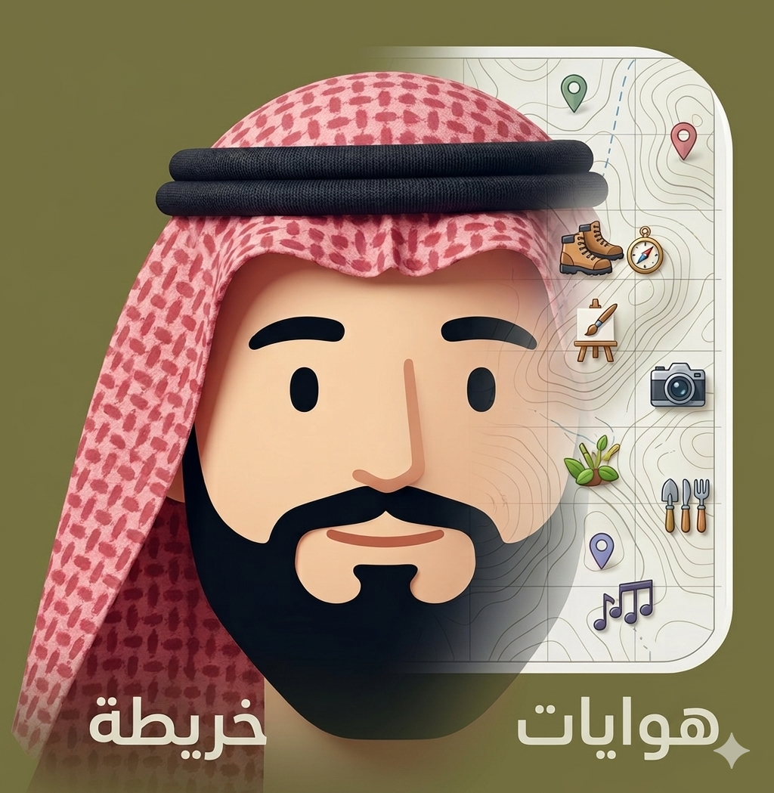
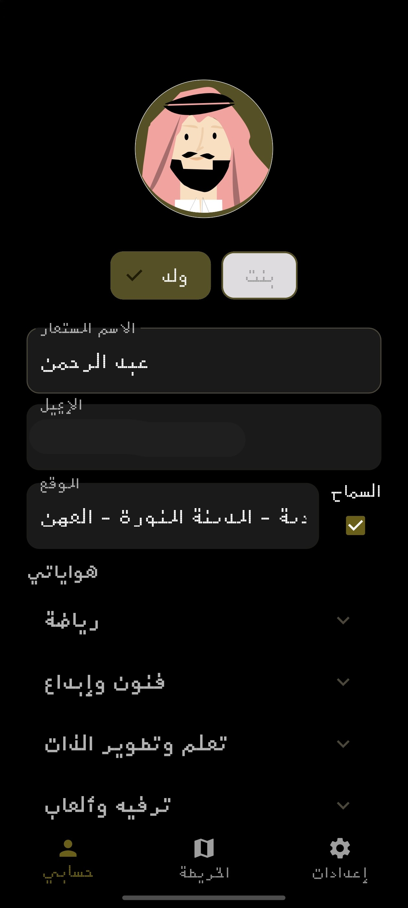
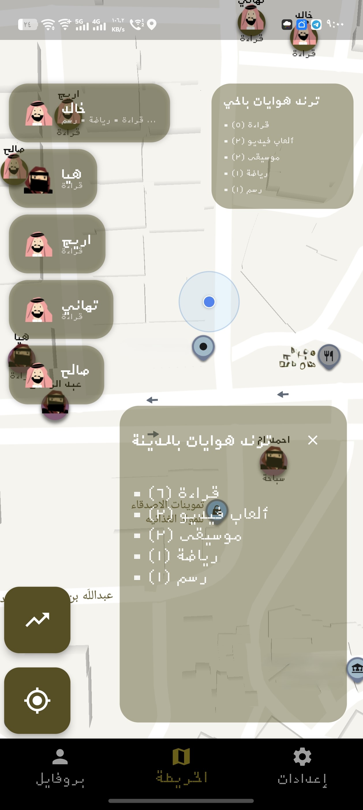
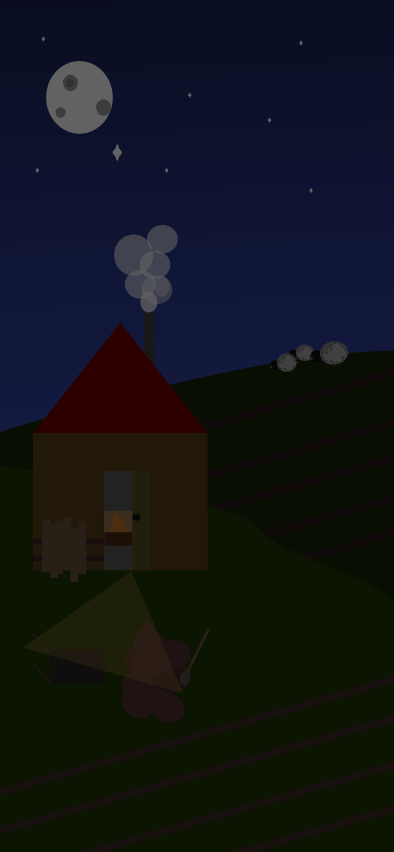

# HawyeenApp ++

  

 

  <a href="https://play.google.com/store/apps/details?id=com.abdulaziz.hobbies" target="_blank">
    👉 <b>Download on Google Play</b>
  </a>

 

  <a href="https://appgallery.huawei.com/app/C116746173?sharePrepath=ag&locale=ar_SA&source=appshare&subsource=C116746173&shareTo=com.android.bips&shareFrom=appmarket&shareIds=2393656293cb4921b1cd8ebaefa72903_com.android.bips&callType=SHARE" target="_blank">
     
    👉 <b>Download on huawei appgallery</b>
  </a>

 

 

🚨 Discover your neighbors’ hobbies with Hawyeen.

  

## 🚨Built with Flutter and Rive animations🚨

  
HawyeenApp – Hobby Community
Hawyeen combines attractive design with smooth animations to deliver an enjoyable and immersive user experience. Your privacy comes first: share hobbies safely on the map using a smart location obfuscation algorithm that shows only your area, not your exact location. Public data includes name, hobbies, and gender only. All other data remains encrypted and secure. Discover new hobbies and connect with an active, safe community. Currently available in Saudi Arabia, with more cities coming soon.

  

<td align="center">
<b>app icon </b> 

</td>

  

<table align="center">
<tr>
<td align="center">
<b>Profile</b> 

</td>

<td align="center">
<b>Map</b> 

</td>

<td align="center">
<b>Settings</b> 

</td>
</tr>
</table>
  

## Various animations are used throughout the app

<table align="center">
<tr>
<td align="center">

</td>

<td align="center">

</td>
</tr>
</table>
  
  
  

[@vuvvvv](https://github.com/vuvvvv)

<!-- 🔹 Meta SEO -->
<meta charset="UTF-8">
<meta name="viewport" content="width=device-width, initial-scale=1.0">
<meta name="description" content="HawyeenApp – Hobby Community
Hawyeen combines attractive design with smooth animations to deliver an enjoyable and immersive user experience. Your privacy comes first: share hobbies safely on the map using a smart location obfuscation algorithm that shows only your area, not your exact location. Public data includes name, hobbies, and gender only. All other data remains encrypted and secure. Discover new hobbies and connect with an active, safe community. Currently available in Saudi Arabia, with more cities coming soon.">
<meta name="keywords" content="🚨Built with Flutter and Rive animations🚨">
<meta name="author" content="HawyeenApp">
<meta name="robots" content="index, follow">

<!-- 🔹 Open Graph (Facebook, WhatsApp, LinkedIn) -->
<meta property="og:title" content="HawyeenApp – Hobby Community
Hawyeen combines attractive design with smooth animations to deliver an enjoyable and immersive user experience. Your privacy comes first: share hobbies safely on the map using a smart location obfuscation algorithm that shows only your area, not your exact location. Public data includes name, hobbies, and gender only. All other data remains encrypted and secure. Discover new hobbies and connect with an active, safe community. Currently available in Saudi Arabia, with more cities coming soon.">
<meta property="og:description" content="🚨Built with Flutter and Rive animations🚨">
<meta property="og:image" content="icon.png">
<meta property="og:url" content="https://github.com/vuvvvv/HawyeenApp">
<meta property="og:type" content="website">
<meta property="og:site_name" content="HawyeenApp">

<!-- 🔹 Twitter Cards -->
<meta name="twitter:card" content="summary_large_image">
<meta name="twitter:title" content="HawyeenApp – Hobby Community
Hawyeen combines attractive design with smooth animations to deliver an enjoyable and immersive user experience. Your privacy comes first: share hobbies safely on the map using a smart location obfuscation algorithm that shows only your area, not your exact location. Public data includes name, hobbies, and gender only. All other data remains encrypted and secure. Discover new hobbies and connect with an active, safe community. Currently available in Saudi Arabia, with more cities coming soon.">
<meta name="twitter:description" content="🚨Built with Flutter and Rive animations🚨">
<meta name="twitter:image" content="icon.png">

<!-- 🔹 Favicon & Theme -->
<link rel="icon" type="image/png" sizes="32x32" href="icon.png">
<link rel="icon" type="image/png" sizes="16x16" href="icon.png">
<meta name="theme-color" content="#0d0d0d">
